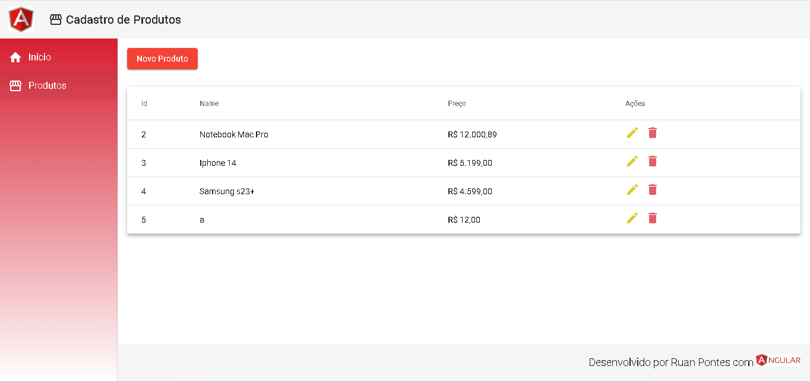

# ANGULAR CRUD

## Visão Geral

Projeto desenvolvido durante o curso angular essencial da cod3r, curso esse que abrange todos os conceitos basicos do angular.

## Principais Conceitos

- **Componentes**: 

- **Rotas**: 

- **Observables**: 

- **Templates**: 

- **Injeção de Dependência**: 

---

